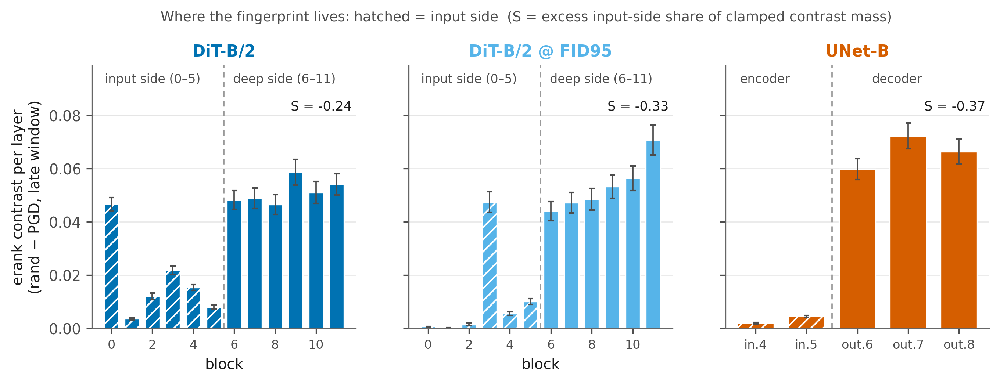
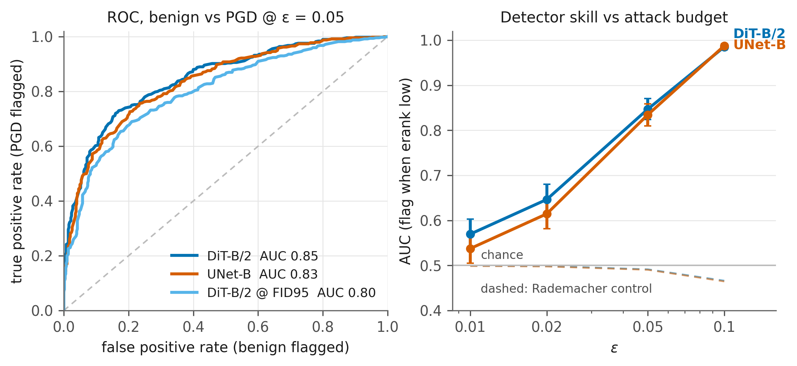
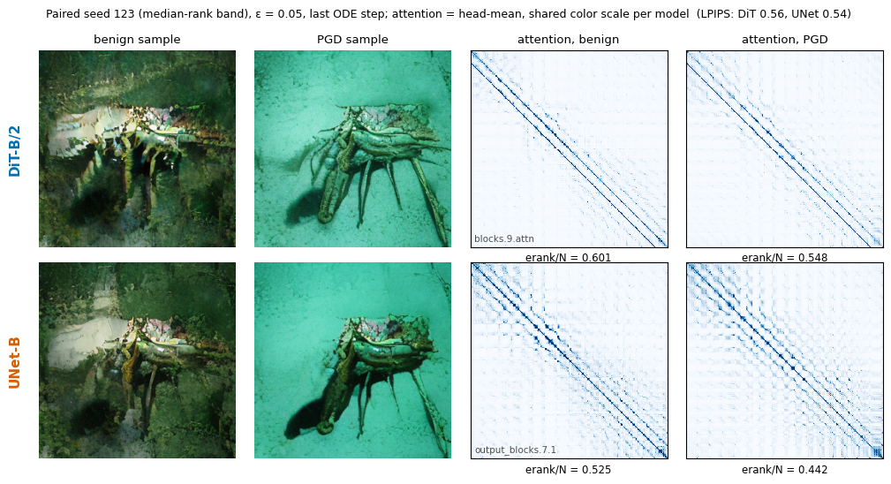

# Disattend

What happens inside the attention of a diffusion model when you adversarially
attack its sampling seed, and does the answer depend on the backbone?

Bachelor's thesis in Mathematical Sciences for Artificial Intelligence,
Sapienza University of Rome.

## The experiment

I trained two class-conditional generative models from scratch under the same
budget: a transformer (SiT-B/2, flow matching) and a UNet of comparable size,
both on SD-VAE latents of ImageNet-256, 6.4M training steps each (about 100M
samples seen). Most of the training ran on my RX 6900 XT; the UNet hit an
fp16 overflow in its attention there and finished on a cloud RTX 3090. The
transformer ends at FID-50k 68.7, the UNet at 99.1, same 25-step Euler
sampler, fp32.

The attack is L_inf PGD on the initial noise `z_T`, backpropagated through
the entire sampler with gradient checkpointing. Every attacked seed is paired
with a Rademacher perturbation of the same per-coordinate budget, so
"adversarial" is always measured against "random of equal size" and the
benign branch cancels out. Attention is captured at every layer and sampling
step and reduced to per-head spectra; the headline metric is the normalized
effective rank (Roy & Vetterli). The confirmatory analysis (grid, statistics,
equivalence margins, controls) was written down and frozen in the repo
history before generating the data, and the analyzer was validated on pilot
data and synthetic checks before touching the real runs. n = 500 paired
seeds per model and eps, shared noise and shared attack init across models.

## What I found

**The attack leaves a large spectral fingerprint.** Under PGD the attention
rank collapses, mostly in the late sampling steps (within-model effect size
d of about 1.3 at eps 0.05). The equal-budget random control leaves attention
essentially untouched, so the fingerprint is specific to the adversarial
direction, not to perturbation size.

**Its magnitude does not tell the backbones apart.** With 500 paired seeds
the DiT-UNet difference in absolute erank units is real but tiny: -0.006,
bounded by an equivalence test below 0.010, a quarter of the effect itself.
One honest caveat: relative to each model's benign rank the UNet responds
about twice as strongly, so "equivalent" holds on the absolute scale the
analysis was registered on, not on every framing.

**Where the fingerprint lives looked architectural, but it is not (only).**
The UNet routes essentially all of it to the decoder, the transformer to its
first and deepest blocks. The catch comes from a control I ran on purpose: the
same transformer stopped early in training, at UNet-level FID. Its depth
profile shifts substantially (the block-0 concentration is not there yet), so
the localization tracks training convergence at least as much as architecture,
and the difference cannot be attributed to the backbone alone.



**The fingerprint is usable as a detector.** Thresholding the late-window
effective rank flags attacked seeds with AUC 0.85 at the output-damage-matched
eps and 0.99 at twice that, stays at chance on random perturbations, and the
operating point expressed in benign z-units transfers across backbones (false
positive rate stays at 4-6% without refitting). This part is exploratory, not
pre-registered.



Perceptually the attack is real but not degrading: attacked samples stay
plausible images of the same class while diverging from the benign ones
(LPIPS about 0.55 at eps 0.05, 15x the random control).



## Repository notes

```
disattend/
  src/           models, attacks (pgd_latent), evaluation, attention hooks
  scripts/       training, sampling, attack grids, analyzers, figures
  experiments/   run outputs (only PREREG.md and analysis.json are versioned)
  third_party/   SiT reference implementation
```

Setup is Linux + ROCm: `uv sync`, then `uv run python scripts/verify_setup.py`.
The heavy artifacts (checkpoints, attention substrates) are not versioned;
every figure above is regenerated from the persisted substrate by the
`make_*` scripts. The UNet baseline comes from a sibling project
([`slowflow`](https://github.com/m4rch1n0/slowflow)), retrained here with an
fp16-safe attention fix to keep the comparison fair.

## Key references

- Peebles & Xie, *Scalable Diffusion Models with Transformers*, ICCV 2023.
- Ma et al., *SiT: Exploring Flow and Diffusion-based Generative Models with
  Scalable Interpolant Transformers*, ECCV 2024.
- Madry et al., *Towards Deep Learning Models Resistant to Adversarial
  Attacks*, ICLR 2018.
- Roy & Vetterli, *The effective rank: a measure of effective dimensionality*,
  EUSIPCO 2007.
- Dong et al., *Attention is not all you need: pure attention loses rank
  doubly exponentially with depth*, ICML 2021.
